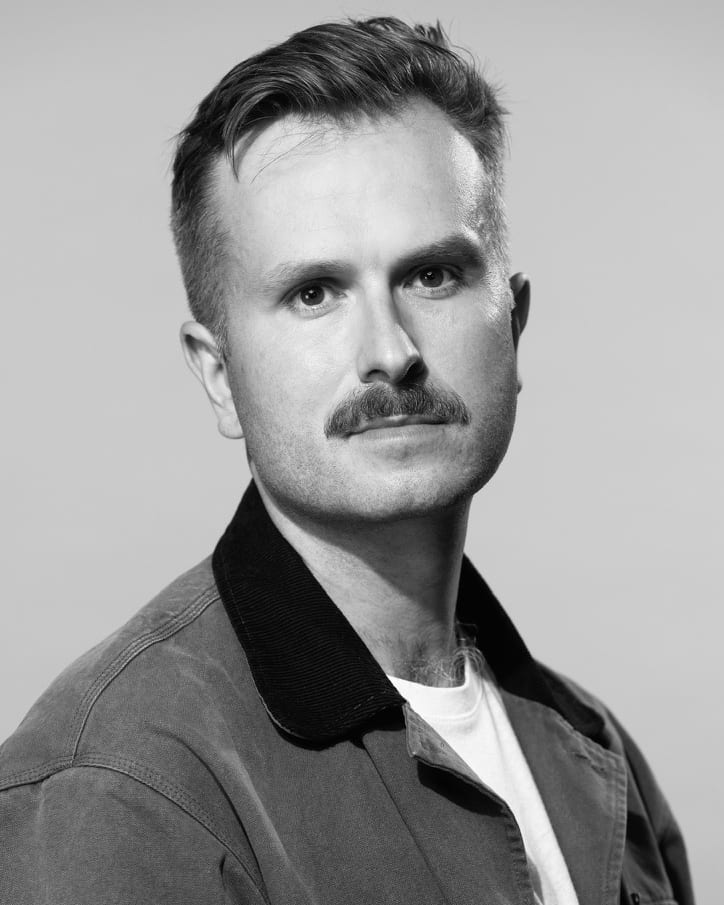

# Toby Coulthard — Portfolio / Resume

A single-page portfolio landing site for Toby Coulthard, Product & Growth leader.
Dark editorial design with a three.js particle-wave hero, GSAP scroll choreography,
and Lenis smooth scrolling.

## Run it

It's a fully static site with no build step. Serve the folder with any static server:

```bash
npx serve .
# or
python3 -m http.server 8000
```

Then open `http://localhost:8000`. (Opening `index.html` directly via `file://`
won't work because the three.js hero is loaded as an ES module.)

## Adding your portrait

In `index.html`, find the `about__portrait-frame` block and replace the
placeholder `<div class="about__portrait-placeholder">…</div>` with:

```html

```

A 4:5 portrait of at least 800×1000px works best.

## Stack

- **GSAP 3 + ScrollTrigger** — preloader, hero reveal, scroll-triggered reveals,
  stat counters, accordion, marquee
- **three.js** — hero particle wave (custom GLSL shaders, cursor repulsion,
  paused when offscreen)
- **Lenis** — smooth scrolling, integrated with ScrollTrigger
- **Fonts** — Syne (display), Space Grotesk (labels), Inter (body), self-hosted woff2

Everything is vendored locally (`vendor/`, `fonts/`) — no CDN dependencies,
works offline.

## Accessibility & performance notes

- `prefers-reduced-motion` is respected throughout: no preloader animation,
  no smooth scroll, static hero frame, all content visible immediately
- The custom cursor only activates on fine-pointer devices
- The hero render loop pauses when the hero is offscreen or the tab is hidden;
  pixel ratio is capped and particle counts reduced on mobile
- Experience entries are real `<button>` accordions with `aria-expanded`
- Tested at 390px (mobile), 768px (tablet), and 1440px (desktop) in headless
  Chrome — zero console errors, zero horizontal overflow
